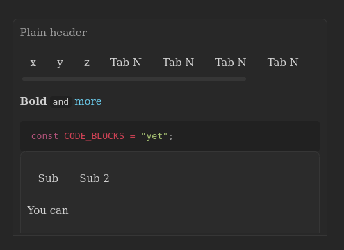

Hey, it's Plugin Markdown Tabs Syntax for Obsidian


##### General syntax:
We create codeblock with language: `tabs` and with each prefixed "+++" — initialize the tabs
````
```tabs
Before tabs <--- Header
+++ label? <--- Syntax for init new tab with title
Down of tab <--- tab content
...


+++ Repeat
Content here
```
````


##### Example:  
`````
````tabs
Plain header
+++ х
**Bold** `and` [more](./d-flex.md)

```ts
const CODE_BLOCKS = "yet";
```

```tabs
\+++ Sub
Yes
\+++ Sub 2
Subtabs
```
+++ y
Second tab
...
````
`````
Screenshot:  


It's still complicated?
Starts with it! into your workspace:
````
```tabs

```
````

##### Plans:
- [x] Plugin starts
- [x] Render TabContainer
- [x] Markdown postprocess in TabContainer
- [x] Styled TabContainer
- [ ] Postprocess obsidian icons for tabs labels (Depends on demand)
- [ ] Postprocess markdown in header (Generally useless, but suddenly...)
- Stability support

